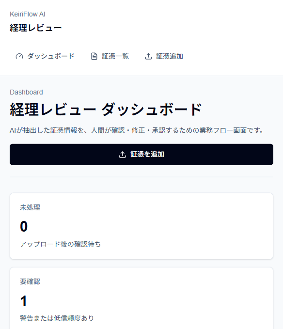
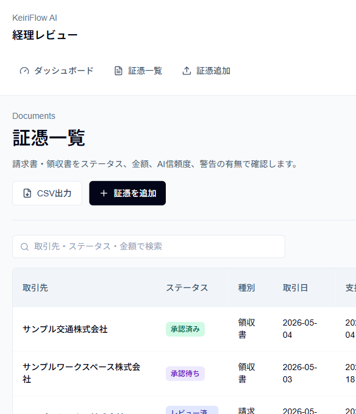
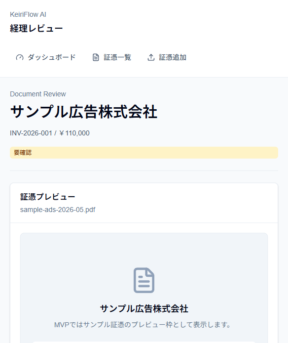
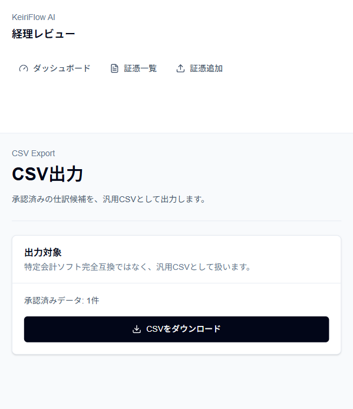

# KeiriFlow AI

KeiriFlow AIは、請求書・領収書をAIで読み取り、仕訳候補、警告、承認、監査ログ、CSV出力まで確認できる経理デモです。

AIが処理を自動で確定するのではなく、候補を出し、人が確認・修正・承認してから次へ進める流れにしています。

公開URLでは、読み取り画面と合成データを確認用キーなしで見られます。証憑登録、更新、AI候補生成、承認、CSV出力は、利用量を抑えるため確認用キーで制限しています。このキーはユーザー認証ではありません。

## 公開URL

- 公開URL: https://keiriflow-ai.atlas-lab.workers.dev
- GitHub: https://github.com/proto-atlas/keiriflow-ai

## 主な流れ

- `/dashboard` で処理状況と警告件数を確認する。
- `/invoices` で証憑一覧を検索・並び替えする。
- `/invoices/new` で請求書・領収書を登録する。
- AIが抽出結果と仕訳候補を返す。
- 担当者が抽出結果、警告、仕訳候補を確認・修正する。
- 承認依頼、承認、差し戻し、CSV出力済みまで状態を進める。
- 修正、警告確認、承認、CSV出力の履歴を監査ログに残す。

## 用語

- 確認用キー: 変更系APIやAI APIの利用量を抑えるためのキー。ユーザーアカウントや権限管理ではありません。
- モック動作: SupabaseやAnthropicの環境変数がない状態でも、用意したデータと固定応答で画面やAPIを確認できる動作。
- Human-in-the-loop: AIの結果をそのまま確定せず、人が確認してから次へ進める設計。
- 監査ログ: 誰がどの操作をしたかを後から確認するための履歴。

## 確認方法

30秒で見る場合は、公開URLのトップ、`/dashboard`、`/invoices` から合成データの一覧と証憑レビュー導線を確認できます。

もう少し詳しく見る場合は、[アーキテクチャ](docs/architecture.md)、[設計判断](docs/design-decisions.md)、[検証記録の一覧](docs/evidence/INDEX.md) を確認してください。

確認用キーが必要な操作は、証憑登録、更新、AI抽出、仕訳候補生成、承認、CSV出力です。公開URLで登録するファイルは合成データに限定します。機密情報、個人情報、実在取引先の証憑は投入しない前提です。

## 画面

以下はモックデータとモック応答で表示した画面です。

| Dashboard | 証憑一覧 |
|---|---|
|  |  |

| 証憑レビュー | CSV出力 |
|---|---|
|  |  |

## ドキュメント

- [アーキテクチャ](docs/architecture.md): 画面、API、repository、AI provider、DBの構成
- [設計判断](docs/design-decisions.md): AIを候補生成に限定した理由、監査ログ、モック動作、確認用キー制限
- [検証記録の一覧](docs/evidence/INDEX.md): CI、外部サービス接続、Lighthouseの確認記録
- [Supabase schema](supabase/schema.sql): Supabase向けのテーブル定義
- [repository境界](src/lib/server/document-repository.ts): モックとSupabaseの保存先切り替え
- [AI provider境界](src/lib/ai/provider.ts): モック応答とAnthropic Messages APIの切り替え

## 検証記録

主な検証記録は [docs/evidence/INDEX.md](docs/evidence/INDEX.md) から確認できます。

- `pnpm lint`: 通過
- `pnpm typecheck`: 通過
- `pnpm test`: 19 files / 118 tests通過
- `pnpm build`: 通過
- GitHub CI: main branchで成功
- Cloudflare build / deploy: 通過
- 外部サービス接続の確認: 合成画像1件で、アップロード、AI抽出、仕訳候補生成、承認、CSV出力、公開読み取りを確認
- Lighthouse: mobile 82 / 100 / 100 / 100、desktop 97 / 100 / 100 / 100

各検証は、その時点の構成と合成データに対する結果です。税務判断、AI抽出精度の一般品質、本番負荷下の性能を示すものではありません。

## ローカル実行

```bash
pnpm install
pnpm dev
```

起動後、`http://localhost:3000/dashboard` を開きます。

品質確認:

```bash
pnpm lint
pnpm typecheck
pnpm test
pnpm build
```

環境変数が未設定の場合は、モックデータとモック応答で動きます。SupabaseやAnthropicを使う場合の設定は、`.env.example`、[アーキテクチャ](docs/architecture.md)、[設計判断](docs/design-decisions.md) を確認してください。

## 現在入れていないもの

- 本番品質の会計ソフトとしての利用
- 税務判断の正確性
- 電子帳簿保存法やインボイス制度への完全対応
- 特定会計ソフトへの完全互換CSV
- AI抽出精度の完全性
- 本番向けの認証・権限管理
- 確認用キーによるユーザー認証
- 外部providerの品質保証
- アップロードファイル内容の完全な真正性検証
- UI全体を通したE2E

## ライセンス

MIT License。詳細は [LICENSE](LICENSE) を参照してください。
