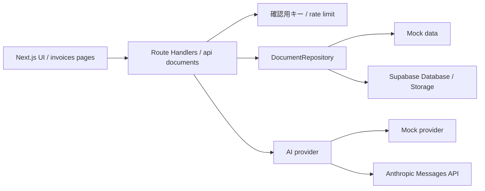

# Architecture

この文書は、KeiriFlow AIの実装構成を説明します。画面、API、データ境界、AI provider境界を短時間で追えることを目的にしています。

## 全体像

環境変数が未設定の場合、repositoryはmock data、AI providerはmock providerに戻ります。これにより、外部サービスを設定していない状態でも業務フローを確認できます。

## 画面

| URL | 役割 |
|---|---|
| `/dashboard` | 処理状況、警告件数、最近の証憑を確認する |
| `/invoices` | 証憑一覧を検索・並び替えする |
| `/invoices/new` | 請求書 / 領収書を登録する |
| `/invoices/[id]` | 抽出結果、仕訳候補、警告、承認、監査ログを確認・更新する |
| `/invoices/export` | 承認済みデータのCSV出力導線 |

## API

| Method | Path | 役割 |
|---|---|---|
| `GET` | `/api/documents` | 証憑一覧取得。合成データ確認用の読み取りroute |
| `POST` | `/api/documents/upload` | 証憑登録 |
| `GET` | `/api/documents/[id]` | 証憑詳細取得。合成データ確認用の読み取りroute |
| `PATCH` | `/api/documents/[id]` | 抽出結果・ステータス更新。確定後の内容更新は拒否 |
| `POST` | `/api/documents/[id]/extract` | AI抽出候補生成。許可状態以外では実行しない |
| `POST` | `/api/documents/[id]/journal-entry/generate` | 仕訳候補生成。候補返却のみで、保存は `PATCH /api/journal-entries/[id]` で行う |
| `PATCH` | `/api/journal-entries/[id]` | 仕訳候補更新 |
| `PATCH` | `/api/documents/[id]/warnings/[warningId]` | 警告ステータス更新 |
| `POST` | `/api/documents/[id]/request-approval` | レビュー済み証憑の承認依頼 |
| `POST` | `/api/approvals/[id]/respond` | 承認 / 差し戻し。pendingの承認依頼だけ受け付ける |
| `GET` | `/api/documents/export.csv` | 汎用CSV出力。GET自体はステータスを変更しない |

Next.js App RouterのRoute Handlerを使い、server-sideでrepositoryとproviderを呼び出します。

`POST /api/documents/upload` の検証は、ファイルサイズ、拡張子、ブラウザから渡されるMIME typeを対象にしています。ファイル内容のmagic byte検証やウイルススキャンは現時点の実装範囲外です。

証憑登録、証憑更新、AI候補生成、承認、CSV出力のrouteは確認用キーで制限します。keyが一致した場合だけ、ハッシュ化した確認用キー / IPとroute groupを `demo_usage_events` に記録し、短時間rate limitとAI系routeの日次上限を判定します。外部接続モードで確認用キーやrate limit storeが欠ける場合は、制限対象routeをfail-closedにします。

## Repository境界

`src/lib/server/document-repository.ts` が、画面・APIとデータ保存先の間にある境界です。

実装は次の2系統です。

- `MockDocumentRepository`: 環境変数なしで動作するデモ用
- `SupabaseDocumentRepository`: Supabase接続用

この境界を置くことで、UIとRoute Handlerは保存先の違いを意識せず、同じメソッドで証憑、仕訳、警告、承認、監査ログを扱います。

mock repositoryのアップロード済み証憑はプロセスメモリ上のデモ状態です。Cloudflare Workersなどの実行環境ではisolateの再起動で消える可能性があるため、永続保存の確認はSupabase modeで行います。

## AI provider境界

`src/lib/ai/provider.ts` が、AI候補生成の境界です。

実装は次の2系統です。

- `MockAiProvider`: 外部APIなしで候補を返す
- `AnthropicAiProvider`: Anthropic Messages APIにdirect fetchで接続する

Anthropicへ接続する場合も、レスポンスはZod schemaで検証します。validationに失敗した出力は保存せず、Route Handlerでは汎用errorとして扱います。

AI抽出routeでは、repositoryから取得したPDF / PNG / JPEGのファイル本文をproviderへ渡します。providerはserver-sideでbase64 化し、Anthropic Messages APIの `document` / `image` content blockとして送ります。仕訳候補生成routeは、抽出済みメタデータから候補を作る設計なので、現時点ではファイル本文を再送しません。

## Workflow

`src/lib/workflow.ts` に、画面とAPIで共有する業務ルールを置いています。

- ステータス表示名
- 次ステータス判定
- PATCHで許可するステータス遷移の判定
- ダッシュボード集計
- 警告生成
- 金額整合性チェック
- CSV生成

警告はAIではなく、明示的なルールで生成します。現在の警告は、高額支出、登録番号未確認、抽出信頼度低、重複候補、金額不一致です。

## データモデル

Supabase schemaでは、以下のテーブルを用意しています。

- `documents`
- `journal_entries`
- `policy_warnings`
- `approvals`
- `audit_logs`
- `demo_usage_events`

RLSは有効化しています。ただし、本番向けの認証・権限管理はこのリポジトリの主張範囲に含めていません。現状はserver-side Route Handlerがservice roleで扱う境界を示すため、anon / authenticated向けpolicyは未定義です。

`demo_usage_events` は公開URLの連打抑制用です。raw確認用キーとraw IPは保存せず、SHA-256 hashのみを保持します。

## 監査ログ

以下の操作で監査ログを残す設計です。

- 証憑更新
- 仕訳候補更新
- 警告確認
- 承認依頼
- 承認 / 差し戻し
- ステータス変更

mock modeではAPIレスポンス単位で更新後の監査ログを返します。Supabase modeでは `audit_logs` tableに保存する設計です。

警告はmock mode / Supabase modeともに `buildPolicyWarnings` のルールを使います。Supabase modeでは証憑作成・更新時に `policy_warnings` tableへ同期し、UIで確認した警告ステータスを保持します。

Supabase modeの警告同期はupsertと不要警告のdeleteを組み合わせます。複数のSupabase操作に分かれるため、完全な原子性ではなく最終的な整合を狙う境界です。

## CSV出力

CSVは `GET /api/documents/export.csv` で出力します。GETは副作用を持たせず、CSV出力済みステータスへの変更は詳細画面のステータス更新で行います。

この分離により、CSVダウンロードの再試行とステータス更新を別操作として扱えます。

CSVセルはExcel / spreadsheetで数式として解釈される先頭文字を無害化してから出力します。

## Deployment境界

公開URLはCloudflare Workers + OpenNext adapterで構成します。

このアプリはNext.js App RouterのRoute Handlerを使っており、静的exportだけではserver-side APIを扱えません。そのため、Cloudflare上ではWorkers runtimeでNext.jsのserver-side routeを動かす前提で検証します。

Cloudflare用の最小設定として、`open-next.config.ts` と `wrangler.jsonc` を追加しています。

WindowsローカルではOpenNextのbundle生成時にsymlink権限で止まるため、Linux runnerで `pnpm cf:build` を確認するGitHub Actions workflowを追加しています。

Linux CI上の `pnpm cf:build`、Cloudflare production envへのdeploy、公開URLでの主要API接続は確認済みです。公開URLでは、確認用キー付きの証憑登録、更新、承認、CSV出力、Supabase保存、Anthropic provider経路を最小件数で確認しています。

## 現在の未確認事項

- UI全体を通したE2E
- 本番向け認証・権限管理
- アップロードファイル内容のmagic byte検証
